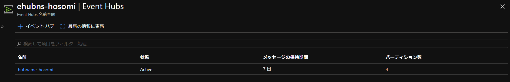
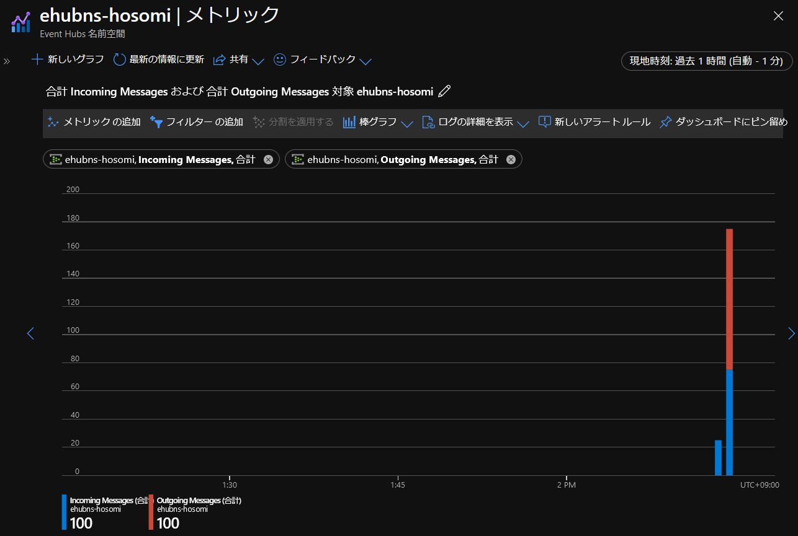
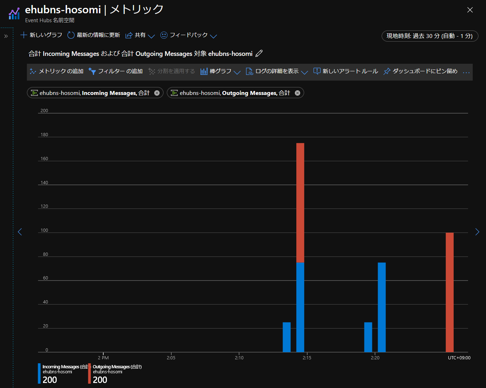

# learn-enable-reliable-messaging-for-big-data-apps-using-event-hubs

https://docs.microsoft.com/ja-jp/learn/modules/enable-reliable-messaging-for-big-data-apps-using-event-hubs/

## 環境

Learn では Java ですが、C# で構築します。  
（一度、 Learn 通りに演習してから C# で実施すると理解が深まります。）  

* Azrue Portal (Concierge Subscription)
* VisualStudio 2019

Microsoft Learn で利用できる Concierge Subscription を利用します。  
作成したリソースはサンドボックスを有効にしてから約 4 時間利用できます。  
約 4 時間経過後、作成したリソースは削除されます（再利用不可です）。  

## 1. Azure CLI 用の既定値を設定

ローカルにインストールした Azure CLI、コンソールは PowerShell で行っています。


``az configure --defaults group=<defaults group> location=<location>`` :

* ``<defaults group>`` : リソースグループの既定値。
* ``<location>`` : リージョンの既定値

```powershell
> az configure --defaults group=learn-416afc63-dc23-4ae1-a5ad-826c4d7ea99c location=japanwest
```

リソースグループはサンドボックスの既定値を利用します。  
リージョンは西日本を指定しています。  

## 2. Azure にログイン

``az login`` : 

ブラウザが起動するのでフォーム認証する。  

```powershell
> az login
You have logged in. Now let us find all the subscriptions to which you have access...
The following tenants don't contain accessible subscriptions. Use 'az login --allow-no-subscriptions' to have tenant level access.
********-****-****-****-************
********-****-****-****-************
[
  {
    "cloudName": "AzureCloud",
    "homeTenantId": "********-****-****-****-************",
    "id": "********-****-****-****-************",
    "isDefault": true,
    "managedByTenants": [],
    "name": "Concierge Subscription",
    "state": "Enabled",
    "tenantId": "********-****-****-****-************",
    "user": {
      "name": "***********@*****.***",
  }
]
```

## 3. Azure に必要なリソースを作成

### 3.1 Azure CLI を使用してイベント ハブを作成

#### 3.1.1 Event Hubs 名前空間を作成する

``az eventhubs namespace create --name <name>`` : 

* ``--name`` : 一意の名前を指定

```powershell
> az eventhubs namespace create --name ehubns-hosomi
{
  "clusterArmId": null,
  "createdAt": "2020-08-06T02:04:06.533000+00:00",
  "encryption": null,
  "id": "/subscriptions/********-****-****-****-************/resourceGroups/learn-416afc63-dc23-4ae1-a5ad-826c4d7ea99c/providers/Microsoft.EventHub/namespaces/ehubns-hosomi",
  "identity": null,
  "isAutoInflateEnabled": false,
  "kafkaEnabled": true,
  "location": "Japan West",
  "maximumThroughputUnits": 0,
  "metricId": "********-****-****-****-************:ehubns-hosomi",
  "name": "ehubns-hosomi",
  "provisioningState": "Succeeded",
  "resourceGroup": "learn-416afc63-dc23-4ae1-a5ad-826c4d7ea99c",
  "serviceBusEndpoint": "https://ehubns-hosomi.servicebus.windows.net:443/",
  "sku": {
    "capacity": 1,
    "name": "Standard",
    "tier": "Standard"
  },
  "tags": {},
  "type": "Microsoft.EventHub/Namespaces",
  "updatedAt": "2020-08-06T02:04:59.620000+00:00",
  "zoneRedundant": false
}
```

#### 3.1.2 イベント ハブの接続文字列を取得

``az eventhubs namespace authorization-rule keys list --name <name> --namespace-name <ehubns-name>`` : 

* ``<name>`` : RootManageSharedAccessKey
* `<ehubns-name>` : 3.1 で作成したサービスバスのリソース名。

```powerhsell
> az eventhubs namespace authorization-rule keys list `
>>     --name RootManageSharedAccessKey `
>>     --namespace-name ehubns-hosomi
{
  "aliasPrimaryConnectionString": null,
  "aliasSecondaryConnectionString": null,
  "keyName": "RootManageSharedAccessKey",
  "primaryConnectionString": "Endpoint=sb://ehubns-hosomi.servicebus.windows.net/;SharedAccessKeyName=RootManageSharedAccessKey;SharedAccessKey=*******************************************",
  "primaryKey": "*******************************************",
  "secondaryConnectionString": "Endpoint=sb://ehubns-hosomi.servicebus.windows.net/;SharedAccessKeyName=RootManageSharedAccessKey;SharedAccessKey=*******************************************",
  "secondaryKey": "*******************************************"
}
```

ソースコードで利用します。  


#### 3.1.3 イベント ハブを作成する

``az eventhubs eventhub create --name <name> --namespace-name <namespace-name>`` : 

* ``<name>`` : 作成するイベントハブの一意の名前。
* ``<namespace-name>`` : 3.1 で作成したサービスバスのリソース名。

```powershell
> az eventhubs eventhub create --namespace-name ehubns-hosomi --name hubname-hosomi
{
  "captureDescription": null,
  "createdAt": "2020-08-06T02:24:22.980000+00:00",
  "id": "/subscriptions/********-****-****-****-************/resourceGroups/learn-416afc63-dc23-4ae1-a5ad-826c4d7ea99c/providers/Microsoft.EventHub/namespaces/ehubns-hosomi/eventhubs/hubname-hosomi",
  "location": "Japan West",
  "messageRetentionInDays": 7,
  "name": "hubname-hosomi",
  "partitionCount": 4,
  "partitionIds": [
    "0",
    "1",
    "2",
    "3"
  ],
  "resourceGroup": "learn-416afc63-dc23-4ae1-a5ad-826c4d7ea99c",
  "status": "Active",
  "type": "Microsoft.EventHub/Namespaces/EventHubs",
  "updatedAt": "2020-08-06T02:24:24.163000+00:00"
}
```

### 3.2 ストレージアカウントの作成

#### 3.2.1 汎用の Standard ストレージ アカウントを作成


``az storage account create --name <name> --sku Standard_RAGRS --encryption-service blob`` : 

* ``<name>`` : 作成するストレージアカウントの名前（英数小文字のみ使えます）。

```powershell
> az storage account create --name storagenamehosomi --sku Standard_RAGRS --encryption-service blob
{
  "accessTier": "Hot",
  "allowBlobPublicAccess": null,
  "azureFilesIdentityBasedAuthentication": null,
  "blobRestoreStatus": null,
  "creationTime": "2020-08-06T02:32:17.075736+00:00",
  "customDomain": null,
  "enableHttpsTrafficOnly": true,
  "encryption": {
    "keySource": "Microsoft.Storage",
    "keyVaultProperties": null,
    "requireInfrastructureEncryption": null,
    "services": {
      "blob": {
        "enabled": true,
        "keyType": "Account",
        "lastEnabledTime": "2020-08-06T02:32:17.138227+00:00"
      },
      "file": {
        "enabled": true,
        "keyType": "Account",
        "lastEnabledTime": "2020-08-06T02:32:17.138227+00:00"
      },
      "queue": null,
      "table": null
    }
  },
  "failoverInProgress": null,
  "geoReplicationStats": null,
  "id": "/subscriptions/********-****-****-****-************/resourceGroups/learn-416afc63-dc23-4ae1-a5ad-826c4d7ea99c/providers/Microsoft.Storage/storageAccounts/storagenamehosomi",
  "identity": null,
  "isHnsEnabled": null,
  "kind": "StorageV2",
  "largeFileSharesState": null,
  "lastGeoFailoverTime": null,
  "location": "japanwest",
  "minimumTlsVersion": null,
  "name": "storagenamehosomi",
  "networkRuleSet": {
    "bypass": "AzureServices",
    "defaultAction": "Allow",
    "ipRules": [],
    "virtualNetworkRules": []
  },
  "primaryEndpoints": {
    "blob": "https://storagenamehosomi.blob.core.windows.net/",
    "dfs": "https://storagenamehosomi.dfs.core.windows.net/",
    "file": "https://storagenamehosomi.file.core.windows.net/",
    "internetEndpoints": null,
    "microsoftEndpoints": null,
    "queue": "https://storagenamehosomi.queue.core.windows.net/",
    "table": "https://storagenamehosomi.table.core.windows.net/",
    "web": "https://storagenamehosomi.z31.web.core.windows.net/"
  },
  "primaryLocation": "japanwest",
  "privateEndpointConnections": [],
  "provisioningState": "Succeeded",
  "resourceGroup": "learn-416afc63-dc23-4ae1-a5ad-826c4d7ea99c",
  "routingPreference": null,
  "secondaryEndpoints": {
    "blob": "https://storagenamehosomi-secondary.blob.core.windows.net/",
    "dfs": "https://storagenamehosomi-secondary.dfs.core.windows.net/",
    "file": null,
    "internetEndpoints": null,
    "microsoftEndpoints": null,
    "queue": "https://storagenamehosomi-secondary.queue.core.windows.net/",
    "table": "https://storagenamehosomi-secondary.table.core.windows.net/",
    "web": "https://storagenamehosomi-secondary.z31.web.core.windows.net/"
  },
  "secondaryLocation": "japaneast",
  "sku": {
    "name": "Standard_RAGRS",
    "tier": "Standard"
  },
  "statusOfPrimary": "available",
  "statusOfSecondary": "available",
  "tags": {},
  "type": "Microsoft.Storage/storageAccounts"
}
```

#### 3.2.2 アクセス キーをすべて一覧表示

``az storage account keys list --account-name <account-name>`` : 

* ``<account-name>`` : 4.1 で作成したストレージアカウントの名前

```powershell
> az storage account keys list --account-name storagenamehosomi
[
  {
    "keyName": "key1",
    "permissions": "Full",
    "value": "****************************************************************************************"
  },
  {
    "keyName": "key2",
    "permissions": "Full",
    "value": "****************************************************************************************"
  }
]
```

#### 3.2.3 作成したストレージアカウントの接続文字列を取得

``az storage account show-connection-string -n <n>`` : 

* ``<n>`` : 4.1 で作成したストレージアカウントの名前

```powershell
> az storage account show-connection-string -n storagenamehosomi
{
  "connectionString": "DefaultEndpointsProtocol=https;EndpointSuffix=core.windows.net;AccountName=storagenamehosomi;AccountKey=***********************************************************************"
}
```

次項で利用します。


#### 3.2.4 ストレージ アカウント内にコンテナー messages を作成


az storage container create -n messages --connection-string "<connectionString>"

* ``<connectionString>`` : 4.3 で取得した接続文字列（接続文字列はダブルクウォートで囲ってください）。

```powershell
> az storage container create -n messages --connection-string "DefaultEndpointsProtocol=https;EndpointSuffix=core.windows.net;AccountName=storagenamehosomi;AccountKey=***********************************************************************"
{
  "created": true
}
```


## 4. Azure Portal イベントハブの確認事項

### 4.1 作成したイベントハブのプロパティ



### 4.2 送信、受信時のメトリック確認

送信は ``Sender`` サブプロジェクトを実行してください。  
接続文字列等は ``Sender/Program.cs`` の定数 ``EventHubConnectionString``, ``EventHubName`` をご自身の環境に合わせて変更してください。  

``dotnet run --project Sender`` :
（ソリューション直下で実行できます。）  

```powershell
> dotnet run --project Sender
```

　  
受信は ``Receiver`` サブプロジェクトを実行してください。  
接続文字列等は ``Receiver/Program.cs`` の定数 ``EventHubConnectionString``, ``EventHubName``, ``StorageContainerName``, ``StorageAccountName``, ``StorageAccountKey`` をご自身の環境に合わせて変更してください。  

``dotnet run --project Receiver`` :
（ソリューション直下で実行できます。）  

```powershell
> dotnet run --project Receiver
```




### 4.3 復旧時の確認




